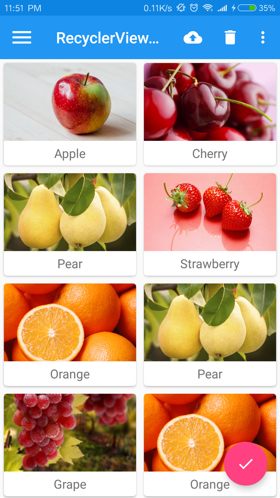
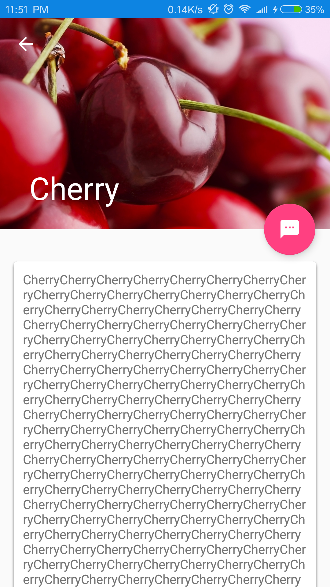

# PhotoWallDemo
照片墙Demo

## 前言
* 在开发中,我们很常都会遇到Android程序爆OOM的问题,然而造成个这问题的原因很多,但
  最为常见就是图片加载过多过大引发的OOM,希望撸一下郭霖先生的照片墙以巩固一下该知
  识点

## RecyclerViewTest
* 虽然我是叫做RecyclerViewTest，但还是一个照片墙啦。只是为了突出使用的是
  RecyclerView。这里的照片的图片均来自res/drawable

### 截图

App体验链接:[recyclerviewtest-debug.apk](https://github.com/simplebam/PhotoWallDemo/releases/download/v1.0/recyclerviewtest-debug.apk)

原项目地址:[guolindev/MaterialTest](https://github.com/guolindev/booksource/tree/master/chapter12/MaterialTest)

## PhotoWallDemo
* 模仿郭霖先生博客而制作的,博客地址:[Android照片墙应用实现，再多的图片也不怕崩溃](https://blog.csdn.net/guolin_blog/article/details/9526203)

### 前言
* 在开发中,我们很常都会遇到Android程序爆OOM的问题,然而造成个这问题的原因很多,但
  最为常见就是图片加载过多过大引发的OOM,希望撸一下郭霖先生的照片墙以巩固一下该知
  识点

### 截图

App体验链接:[recyclerviewtest-debug.apk](https://github.com/simplebam/PhotoWallDemo/releases/download/v1.0/recyclerviewtest-debug.apk)

原项目地址:[Android照片墙应用实现，再多的图片也不怕崩溃 - CSDN博客](https://blog.csdn.net/guolin_blog/article/details/9526203)

## 推荐-推荐的不仅仅是技术
* [手把手教你从零开始做一个好看的 APP - 简书 ](https://www.jianshu.com/p/8d2d74d6046f)
* [手把手教你做个人 app - Android - 掘金 ](https://juejin.im/entry/58209b48d2030900550e3249)
* [中文技术文档的写作规范 - DiyCode](https://www.diycode.cc/topics/941)
* [就如何高效学习的一点建议 ](http://mp.weixin.qq.com/s/Mk7O8gLBYZDj1FUNIdpiSw)
* [基于 zxing 的二维码扫描 ](http://mp.weixin.qq.com/s/nPZFBdPOt2KeTaPA877BsA)
* [大公司更喜欢什么样的人才？ ](http://mp.weixin.qq.com/s/NOg80NCf1k_sRNBeA-ptGA)
* [【程序员变帅指南】相亲不穿特步，提升衣品变酷 ](http://mp.weixin.qq.com/s/LuVzlcE5vO6XjY_LixISwg)

## Support
最近在项目中学习,在项目中成长,所以亲们会看到我在项目里面写博客啦,哈哈哈  
如果你喜欢这个repository，请我喝杯咖啡，我会让它更完美~  

<a href="get_me_a_drink.png">