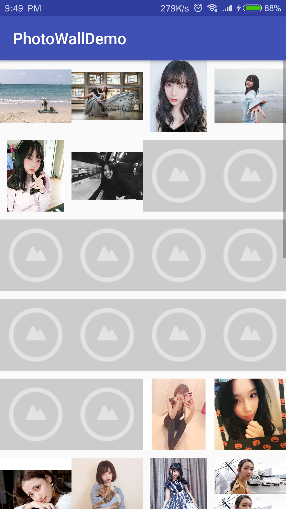

## PhotoWallDemo
照片墙Demo

### 前言
* 在开发中,我们很常都会遇到Android程序爆OOM的问题,然而造成个这问题的原因很多,但
  最为常见就是图片加载过多过大引发的OOM,希望撸一下郭霖先生的照片墙以巩固一下该知
  识点

### 截图

App体验链接:[recyclerviewtest-debug.apk](https://github.com/simplebam/PhotoWallDemo/releases/download/v1.0/recyclerviewtest-debug.apk)

原项目地址:[Android照片墙应用实现，再多的图片也不怕崩溃 - CSDN博客](https://blog.csdn.net/guolin_blog/article/details/9526203)

## 参考博客
* LruCache:
  * [Android高效加载大图、多图解决方案，有效避免程序OOM - CSDN博客 ](https://blog.csdn.net/guolin_blog/article/details/9316683)
  * [LruCache详解以及实战 - CSDN博客 ](https://blog.csdn.net/simplebam/article/details/79574368)
  * [Android照片墙应用实现，再多的图片也不怕崩溃 - CSDN博客 ](https://blog.csdn.net/guolin_blog/article/details/9526203)
* DiskLruCache:
  * [Android DiskLruCache完全解析，硬盘缓存的最佳方案 - CSDN博客](https://blog.csdn.net/guolin_blog/article/details/28863651)

## 数据来源
* 干活集中营:[拿着 Api 去玩耍 ](http://gank.io/api)